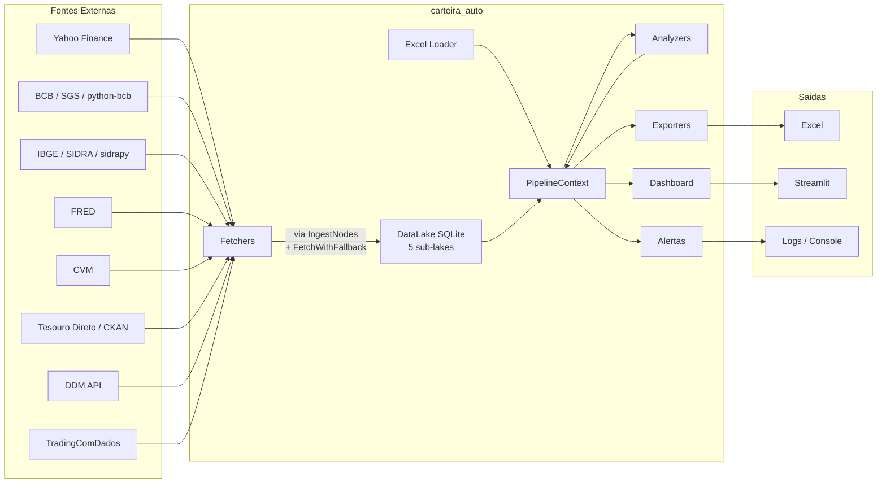
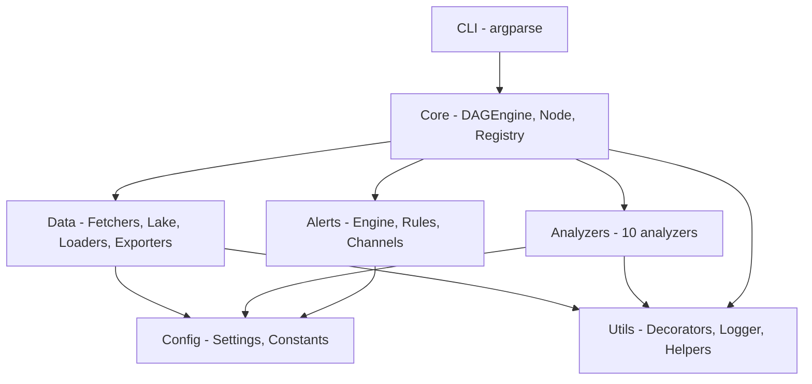
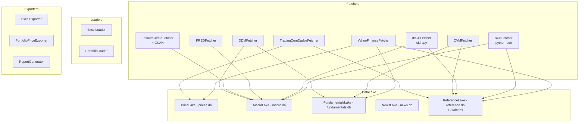
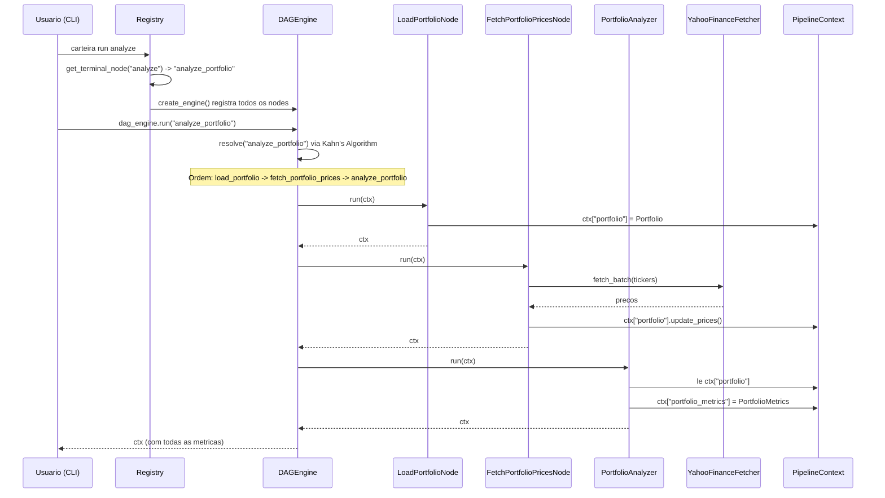

# Arquitetura do carteira_auto

Guia de arquitetura para desenvolvedores. Descreve as camadas, fluxo de dados,
decisoes de design e padroes de codigo do sistema.

---

## 1. Visao Geral

O **carteira_auto** e um sistema de automacao de carteira de investimentos
voltado para pessoa fisica no Brasil. Seu objetivo e consolidar dados de
multiplas fontes (Yahoo Finance, BCB, IBGE, FRED, CVM, Tesouro Direto, DDM, TradingComDados),
calcular metricas de risco e retorno, gerar recomendacoes de rebalanceamento
e publicar resultados via Excel, dashboard e alertas.

O sistema e single-user, roda localmente e persiste dados em SQLite.

### Arquitetura de alto nivel



### Principios fundamentais

- **DAG Pipeline** — nodes declaram dependencias; a engine resolve a ordem via
  topological sort (Kahn's Algorithm).
- **PipelineContext** — dict tipado que carrega dados entre nodes. Sem estado global.
- **Single Responsibility** — fetchers so buscam, analyzers so calculam,
  strategies so decidem.
- **Backward Compatibility** — pipelines existentes nunca quebram ao adicionar
  novos componentes.

---

## 2. Camadas do Sistema



### 2.1 Config (`config/`)

Configuracao centralizada via dataclasses. Toda constante, path ou parametro
de fetcher vive aqui.

| Modulo | Responsabilidade |
|--------|-----------------|
| `settings.py` | Dataclasses de configuracao: `PathsConfig`, `YahooFetcherConfig`, `BCBConfig`, `IBGEConfig`, `DDMConfig`, `FREDConfig`, `TradingComDadosConfig`, `PortfolioConfig`, `LoggingConfig`, `BaseFetcherConfig` |
| `constants.py` | Constantes do dominio: colunas da planilha, field maps, BCB_SERIES_CODES (57), IBGE_TABLE_IDS (17), FRED_SERIES (38 com metadados), INDEX_CODES (6), padroes de ticker, horarios B3, feriados |

**Regra**: toda nova configuracao e adicionada como dataclass em `settings.py`.
Toda nova constante de dominio vai em `constants.py`.

### 2.2 Utils (`utils/`)

Funcionalidades transversais reutilizadas por todas as camadas.

| Modulo | Responsabilidade |
|--------|-----------------|
| `decorators.py` | `@timer`, `@retry`, `@rate_limit`, `@timeout`, `@fallback`, `@validate_tickers`, `@validate_positive_value`, `@validate_allocation_sum`, `@log_execution`, `@cache_result`, `@cache_by_ticker` |
| `logger.py` | `setup_logging()`, `get_logger(name)` com RichHandler (console) e RotatingFileHandler (arquivo) |
| `helpers.py` | `validate_ticker()` e utilitarios genericos |

**Regra**: todo modulo novo usa `logger = get_logger(__name__)`.
Todo fetcher usa `@retry`, `@rate_limit`, `@log_execution`.

### 2.3 Core (`core/`)

Orquestracao de pipelines. O coracao do sistema.

| Modulo | Responsabilidade |
|--------|-----------------|
| `engine.py` | `DAGEngine` (registro + resolucao + execucao), `Node` (ABC), `PipelineContext` (dict tipado) |
| `result.py` | `Result` type (`Ok[T]` / `Err[T]`) para propagacao explicita de erros |
| `registry.py` | `PIPELINE_PRESETS` (mapa CLI -> node terminal), `create_engine()` (fabrica que registra todos os nodes) |
| `models/` | Modelos Pydantic: `Asset`, `Portfolio`, `SoldAsset`, `PortfolioMetrics`, `RiskMetrics`, `MacroContext`, `MarketMetrics`, `CurrencyMetrics`, `CommodityMetrics`, `FiscalMetrics`, `RebalanceRecommendation`, modelos economicos |
| `nodes/` | Implementacoes de `Node`: `portfolio_nodes.py`, `ingest_nodes.py`, `storage_nodes.py`, `alert_nodes.py`, `fetch_helpers.py` (FetchWithFallback) |
| `pipelines/` | Scripts de pipeline legados (ex: `update_excel_prices.py`) |

**Regra**: `DAGEngine` e `Node` nao sao alterados. Novos componentes se plugam
como subclasses de `Node`.

### 2.4 Data (`data/`)

Camada de dados: coleta, persistencia, carga e exportacao.



**Fetchers** (7 implementados, 1 planejado):

| Fetcher | Fonte | Motor interno | Dados |
|---------|-------|---------------|-------|
| `YahooFinanceFetcher` | Yahoo Finance | yfinance | Precos OHLCV, dividendos, fundamentalistas, analyst targets, upgrades, major holders, news |
| `BCBFetcher` | BCB | python-bcb (6 mixins: SGS, Focus, PTAX, TaxaJuros, MercadoImobiliário, Base) | 57 séries SGS, Focus expectations, PTAX, câmbio, taxas de crédito, 14 indicadores imobiliários |
| `IBGEFetcher` | IBGE | sidrapy + HTTP | 17 tabelas SIDRA (incl. analfabetismo), CNAE, indicadores por país |
| `FREDFetcher` | Federal Reserve | requests (FRED API) | 38 séries macro US com 23 convenience methods (yields, Fed Funds, CPI, commodities, câmbio) |
| `CVMFetcher` | CVM | HTTP | DFP/ITR, cadastro de fundos, FIIs, intermediários, carteiras CDA |
| `TesouroDiretoFetcher` | Tesouro Nacional | CSV + CKAN | Títulos públicos, taxas, curva de juros, vendas, resgates, estoque |
| `DDMFetcher` | Dados de Mercado | HTTP (API key) | Cotações, fundamentos, DRE, FIIs, macro, yield curves, risco |
| `TradingComDadosFetcher` | TradingComDados | tradingcomdados (gratuito) | Composição de índices (IBOV, IFIX, etc.), listas de ativos (ações, FIIs, BDRs, ETFs) — **planejado Sprint C** |

**FetchWithFallback** — helper de fallback hierárquico (`core/nodes/fetch_helpers.py`):
- Tenta fontes na ordem de prioridade (gratuito antes de pago)
- Loga warning em fallback, error se todas falharem
- Rastreia proveniência via `result.source`
- Usado pelos IngestNodes para orquestrar entre fetchers diferentes

**DataLake** — fachada unificada (`DataLake`) sobre 5 sub-lakes SQLite:

| Sub-lake | Arquivo | Conteudo |
|----------|---------|----------|
| `PriceLake` | `prices.db` | Series OHLCV por ticker |
| `MacroLake` | `macro.db` | Series de indicadores macroeconomicos (BCB, IBGE, FRED, Tesouro, DDM) |
| `FundamentalsLake` | `fundamentals.db` | Indicadores e demonstracoes financeiras por ticker |
| `NewsLake` | `news.db` | Artigos e scores de sentimento |
| `ReferenceLake` | `reference.db` | 12 tabelas: composição de índices, Focus expectations, analyst targets, upgrades/downgrades, taxas de crédito, CNAE, ticker→CNPJ, major holders, cadastro de fundos, carteiras CDA, intermediários, registro de ativos |

### 2.5 Analyzers (`analyzers/`)

Cada analyzer e um `Node` do DAG. Le dados do `PipelineContext`, calcula
metricas e escreve resultados de volta no contexto.

| Analyzer | Node name | Dependencias | Produz no contexto |
|----------|-----------|--------------|--------------------|
| `PortfolioAnalyzer` | `analyze_portfolio` | `fetch_portfolio_prices` | `portfolio_metrics` |
| `RiskAnalyzer` | `analyze_risk` | `analyze_portfolio` | `risk_metrics` |
| `MacroAnalyzer` | `analyze_macro` | (nenhuma) | `macro_context` |
| `MarketAnalyzer` | `analyze_market` | (nenhuma) | `market_metrics` |
| `Rebalancer` | `rebalance` | `analyze_portfolio` | `rebalance_recommendations` |
| `MarketSectorAnalyzer` | `analyze_market_sectors` | `fetch_portfolio_prices` | `market_sectors` |
| `EconomicSectorAnalyzer` | `analyze_economic_sectors` | (nenhuma) | `economic_sectors` |
| `CurrencyAnalyzer` | `analyze_currency` | (nenhuma) | `currency_metrics` |
| `CommodityAnalyzer` | `analyze_commodities` | (nenhuma) | `commodity_metrics` |
| `FiscalAnalyzer` | `analyze_fiscal` | (nenhuma) | `fiscal_metrics` |

### 2.6 Alerts (`alerts/`)

Sistema de alertas baseado em regras.

| Componente | Responsabilidade |
|------------|-----------------|
| `AlertRule` | Modelo Pydantic: nome, condicao, threshold, severidade |
| `Alert` | Alerta disparado: regra + valor + timestamp + mensagem |
| `AlertEngine` | Avalia regras contra o contexto e gera alertas |
| `ConsoleChannel` | Canal de saida: imprime no terminal |
| `LogChannel` | Canal de saida: grava em arquivo de log |

### 2.7 CLI (`cli/`)

Interface de linha de comando via `argparse`. Entry point: `carteira`.

```
carteira run <pipeline> [--source] [--output] [--dry-run]
carteira list
carteira ingest [--mode daily|full]
carteira dashboard
carteira update-prices  (alias backward-compatible)
```

O CLI resolve o nome do pipeline via `PIPELINE_PRESETS` no registry,
cria a engine com `create_engine()` e executa `dag_engine.run(terminal_node)`.

---

## 3. Fluxo de Dados

### Execucao de um pipeline tipico



### Passo a passo detalhado

1. **CLI invoca pipeline** — o usuario executa `carteira run analyze`.
   O registry mapeia o nome para o node terminal `analyze_portfolio`.

2. **DAGEngine resolve dependencias** — a partir do node terminal, a engine
   caminha para tras coletando dependencias transitivas (BFS reversa),
   depois ordena via Kahn's Algorithm (topological sort).

3. **Nodes executam em ordem** — cada node recebe o `PipelineContext`,
   le o que precisa, executa sua logica e escreve resultados de volta.

4. **Fetchers coletam dados externos** — nodes de fetch delegam para
   fetchers especializados (`YahooFinanceFetcher`, `BCBFetcher`, etc.)
   que usam `@retry` e `@rate_limit` para resiliencia.

5. **DataLake persiste/recupera dados** — nodes de ingestao (`IngestPricesNode`,
   `IngestMacroNode`, etc.) usam fetchers e persistem no DataLake.
   Analyzers podem consultar o lake para dados historicos.

6. **Analyzers calculam metricas** — cada analyzer le dados do contexto,
   calcula metricas de dominio (risco, retorno, macro) e escreve
   modelos Pydantic de volta no contexto.

7. **Resultados disponiveis** — apos a execucao, o `PipelineContext`
   contem todos os dados para exportacao (Excel), alertas ou dashboard.

---

## 4. Decisoes Arquiteturais

### DAG sobre pipeline linear

**Decisao**: usar um grafo aciclico dirigido (DAG) em vez de pipeline sequencial.

**Motivo**: permite reuso de nodes entre pipelines diferentes. O pipeline
`analyze` e `rebalance` compartilham `LoadPortfolioNode` e `FetchPortfolioPricesNode`.
Adicionar um novo analyzer nao exige alterar pipelines existentes — basta
declarar dependencias e registrar o node.

### Strategy != Node

**Decisao**: estrategias de investimento (`Strategy`) nao sao nodes diretamente.
Um `StrategyNode(Node)` serve como ponte.

**Motivo**: strategies tem ciclo de vida proprio (backtesting, otimizacao,
composicao layered). Acopla-las diretamente ao DAG limitaria flexibilidade.
O `StrategyNode` adapta a interface `Strategy.evaluate(ctx) -> StrategyResult`
para o protocolo `Node.run(ctx) -> PipelineContext`.

### SQLite sobre PostgreSQL

**Decisao**: usar SQLite como backend do DataLake.

**Motivo**: o sistema e single-user, roda localmente. SQLite e zero-config,
nao requer servidor, e performante para volumes de dados de pessoa fisica
(milhares de registros, nao milhoes). Cada sub-lake tem seu proprio arquivo
`.db`, garantindo isolamento.

### Composicao Layered para estrategias

**Decisao**: `CompositeStrategy` usa composicao em camadas (layered) com
gates condicionais como padrao.

**Motivo**: permite combinar multiplas estrategias (fundamentalista, tecnica,
macro) com pesos e condicoes de ativacao. Um gate macro pode desativar a
camada tecnica em periodos de crise.

### AI nunca executa

**Decisao**: modulos de IA (Claude, Deepseek) apenas analisam, narram e
recomendam. Nunca executam ordens ou modificam a carteira automaticamente.

**Motivo**: seguranca financeira. A decisao final e sempre do investidor.
A IA complementa a analise quantitativa com raciocinio qualitativo.

---

## 5. Error Handling

O sistema usa multiplas camadas de tratamento de erros:

### 5.1 DAGEngine — fail_fast vs tolerante

```python
dag_engine = DAGEngine(fail_fast=False)  # padrao: tolerante
```

- **`fail_fast=True`**: levanta `NodeExecutionError` no primeiro erro.
  Util para debugging e testes.
- **`fail_fast=False`** (padrao): registra erros em `ctx["_errors"]` e
  continua executando os nodes restantes. Permite que pipelines parcialmente
  funcionais ainda produzam resultados uteis.

Erros sao registrados como `dict[str, str]`:
```python
ctx["_errors"] = {
    "analyze_macro": "ConnectionError: BCB API indisponivel",
    "analyze_risk": "ValueError: dados insuficientes para VaR",
}
```

### 5.2 Result type — Ok / Err

Para propagacao explicita de erros dentro de analyzers e calculos:

```python
from carteira_auto.core.result import Result, Ok, Err

def calcular_var(dados: pd.DataFrame) -> Result[float]:
    if len(dados) < 30:
        return Err("Dados insuficientes para calculo de VaR")
    valor = ...
    return Ok(valor)
```

Inspirado no `Result` do Rust. Evita que excecoes sejam engolidas
silenciosamente e forca o chamador a tratar ambos os casos.

### 5.3 Decorators de resiliencia

Fetchers usam decorators para resiliencia em chamadas externas:

- **`@retry(max_attempts=3, delay=1.0)`** — retenta com exponential backoff
- **`@rate_limit(calls=30, period=60)`** — limita requisicoes por minuto
- **`@timeout(seconds=30)`** — aborta chamadas lentas
- **`@fallback(default_value)`** — retorna valor padrao em caso de falha

### 5.4 Validacao Pydantic

Modelos de dados usam Pydantic para validacao na entrada:

```python
class Asset(BaseModel):
    ticker: str
    quantidade: float
    preco_medio: float

    @field_validator("quantidade")
    @classmethod
    def quantidade_positiva(cls, v):
        if v <= 0:
            raise ValueError("Quantidade deve ser positiva")
        return v
```

---

## 6. Padroes de Codigo

### 6.1 Padrao Fetcher

Todo fetcher segue a mesma estrutura:

```python
class ExemploFetcher:
    """Busca dados de [fonte].

    Configuracao via [Config] em settings.py.
    """

    def __init__(self, config: ExemploConfig | None = None):
        self._config = config or settings.exemplo
        self._logger = get_logger(__name__)

    @retry(max_attempts=3, delay=1.0)
    @rate_limit(calls=30, period=60)
    @log_execution
    def fetch(self, parametros) -> pd.DataFrame:
        """Busca dados. Retorna DataFrame padronizado."""
        ...
```

Caracteristicas: retry com backoff, rate limiting, logging, configuracao
via dataclass injetavel.

### 6.2 Padrao Analyzer (Node)

Todo analyzer e um `Node` do DAG:

```python
class ExemploAnalyzer(Node):
    """Calcula [metricas].

    Le do contexto:
        - "chave_entrada": TipoEntrada

    Produz no contexto:
        - "chave_saida": TipoSaida
    """

    name = "nome_unico"
    dependencies = ["node_predecessor"]

    @log_execution
    def run(self, ctx: PipelineContext) -> PipelineContext:
        entrada = ctx["chave_entrada"]
        resultado = self._calcular(entrada)
        ctx["chave_saida"] = resultado
        return ctx
```

Caracteristicas: `name` e `dependencies` como atributos de classe,
docstring documenta chaves de entrada/saida, `@log_execution` no `run`.

### 6.3 Padrao de error tracking

Nodes que podem falhar parcialmente registram erros sem interromper o pipeline:

```python
def run(self, ctx: PipelineContext) -> PipelineContext:
    errors = ctx.get("_errors", {})
    try:
        resultado = self._operacao_arriscada()
        ctx["resultado"] = resultado
    except Exception as e:
        errors[self.name] = f"{type(e).__name__}: {e}"
        logger.error(f"Falha em {self.name}: {e}")
    ctx["_errors"] = errors
    return ctx
```

### 6.4 Padrao de validacao (Pydantic)

Modelos de dominio usam `field_validator` para garantir integridade:

```python
class Portfolio(BaseModel):
    assets: list[Asset]
    sold_assets: list[SoldAsset] = []

    @field_validator("assets")
    @classmethod
    def pelo_menos_um_ativo(cls, v):
        if not v:
            raise ValueError("Portfolio deve ter pelo menos um ativo")
        return v
```

### 6.5 Checklist obrigatorio para codigo novo

- [ ] Type hints em todas as funcoes e metodos
- [ ] Docstrings documentando o que faz, o que le e o que produz
- [ ] `logger = get_logger(__name__)` no topo do modulo
- [ ] Decorators aplicados onde apropriado (`@log_execution`, `@retry`, etc.)
- [ ] Testes correspondentes em `tests/`
- [ ] Configuracoes em `settings.py` / `constants.py`
- [ ] Sem imports circulares

---

## 7. Estrutura de Diretorios

```
carteira_auto/
├── CLAUDE.md                          # Governanca de desenvolvimento
├── README.md                          # Documentacao do projeto
├── pyproject.toml                     # Configuracao do projeto (build, deps)
├── requirements.txt                   # Dependencias de producao
├── requirements-dev.txt               # Dependencias de desenvolvimento
│
├── docs/
│   ├── system/                        # Docs do sistema (plano, arquitetura, guias)
│   │   ├── architecture.md            # Este documento
│   │   ├── plano_implementacao_carteira_auto.md  # Source of truth arquitetural
│   │   ├── api_reference.md           # Referencia de API dos fetchers
│   │   ├── quickstart.md              # Guia de inicio rapido
│   │   └── developer_guide.md         # Guia para contribuidores
│   └── dev/                           # Docs de referencia para Claude Code
│       ├── ARCHITECTURE.md            # Mapa compacto de modulos e ctx keys
│       ├── PATTERNS.md                # Templates canonicos de codigo
│       └── DEPENDENCY_GRAPH.mermaid   # Grafo de dependencias
│
├── src/carteira_auto/
│   ├── __init__.py                    # Versao e metadata
│   ├── __main__.py                    # Entry point: python -m carteira_auto
│   ├── __version__.py                 # Versao do pacote
│   │
│   ├── config/                        # Configuracao centralizada
│   │   ├── settings.py                # Dataclasses de configuracao
│   │   └── constants.py               # Constantes de dominio
│   │
│   ├── utils/                         # Funcionalidades transversais
│   │   ├── decorators.py              # @timer, @retry, @rate_limit, etc.
│   │   ├── logger.py                  # Logging com Rich + RotatingFile
│   │   └── helpers.py                 # Utilitarios genericos
│   │
│   ├── core/                          # Orquestracao
│   │   ├── engine.py                  # DAGEngine, Node ABC, PipelineContext
│   │   ├── result.py                  # Result type (Ok/Err)
│   │   ├── registry.py                # PIPELINE_PRESETS, create_engine()
│   │   ├── models/                    # Modelos Pydantic de dominio
│   │   │   ├── portfolio.py           # Asset, Portfolio, PortfolioMetrics
│   │   │   ├── analysis.py            # RiskMetrics, MarketMetrics, etc.
│   │   │   └── economic.py            # MacroContext, modelos economicos
│   │   ├── nodes/                     # Implementacoes de Node
│   │   │   ├── portfolio_nodes.py     # Load, Fetch, Export
│   │   │   ├── ingest_nodes.py        # IngestPrices, IngestMacro, etc.
│   │   │   ├── fetch_helpers.py       # FetchWithFallback (fallback hierárquico)
│   │   │   ├── storage_nodes.py       # SaveSnapshot
│   │   │   └── alert_nodes.py         # EvaluateAlerts
│   │   └── pipelines/                 # Scripts de pipeline legados
│   │       └── update_excel_prices.py
│   │
│   ├── data/                          # Camada de dados
│   │   ├── fetchers/                  # Coleta de dados externos (8 fetchers)
│   │   │   ├── yahoo_fetcher.py       # Yahoo Finance (precos, fundamentos, targets, holders)
│   │   │   ├── bcb/                    # BCB (módulo com 6 mixins: SGS, Focus, PTAX, TaxaJuros, MercadoImobiliário)
│   │   │   ├── ibge_fetcher.py        # IBGE (sidrapy: SIDRA, CNAE, países)
│   │   │   ├── fred_fetcher.py        # FRED (38 séries macro US)
│   │   │   ├── cvm_fetcher.py         # CVM (fundos, FIIs, DFP/ITR, intermediários)
│   │   │   ├── tesouro_fetcher.py     # Tesouro Direto (CSV + CKAN)
│   │   │   ├── ddm_fetcher.py         # DDM (cotações, fundamentos, yield curves)
│   │   │   └── tradingcomdados_fetcher.py  # TradingComDados (índices, listas de ativos)
│   │   ├── lake/                      # DataLake (SQLite — 5 sub-lakes)
│   │   │   ├── base.py                # DataLake (fachada unificada)
│   │   │   ├── price_lake.py          # PriceLake (OHLCV)
│   │   │   ├── macro_lake.py          # MacroLake (indicadores temporais)
│   │   │   ├── fundamentals_lake.py   # FundamentalsLake (DRE, balanço)
│   │   │   ├── news_lake.py           # NewsLake (artigos, sentimento)
│   │   │   └── reference_lake.py      # ReferenceLake (12 tabelas de referência)
│   │   ├── loaders/                   # Carga de dados locais
│   │   │   └── excel_loader.py        # ExcelLoader, PortfolioLoader
│   │   ├── exporters/                 # Exportacao de resultados
│   │   │   ├── excel_exporter.py      # ExcelExporter
│   │   │   └── report_generator.py    # ReportGenerator
│   │   └── storage/                   # Persistencia auxiliar
│   │       └── snapshot_store.py      # SnapshotStore (JSON)
│   │
│   ├── analyzers/                     # Analise e metricas (10 analyzers)
│   │   ├── portfolio_analyzer.py      # Metricas consolidadas da carteira
│   │   ├── risk_analyzer.py           # VaR, Sharpe, beta, drawdown
│   │   ├── macro_analyzer.py          # Contexto macroeconomico
│   │   ├── market_analyzer.py         # 8 benchmarks (IBOV, IFIX, CDI, S&P500, USD, Ouro, Selic, PTAX)
│   │   ├── rebalancer.py              # Recomendacoes de rebalanceamento
│   │   ├── market_sector_analyzer.py  # Setores de mercado
│   │   ├── economic_sector_analyzer.py # Setores da economia real
│   │   ├── currency_analyzer.py       # Cambio USD/BRL, DXY, carry trade
│   │   ├── commodity_analyzer.py      # Petroleo, ouro, soja, ciclo 5y
│   │   └── fiscal_analyzer.py         # Divida/PIB, resultado primario, trajetoria
│   │
│   ├── alerts/                        # Sistema de alertas
│   │   ├── engine.py                  # AlertEngine, AlertRule, Alert
│   │   ├── rules.py                   # Regras pre-configuradas
│   │   └── channels.py               # ConsoleChannel, LogChannel
│   │
│   └── cli/                           # Interface de linha de comando
│       └── commands.py                # Parser argparse, comandos
│
├── tests/                             # Testes (pytest)
├── dashboards/                        # Dashboard Streamlit
│   ├── app.py                         # Entry point do dashboard
│   └── pages/                         # Paginas do dashboard
├── notebooks/                         # Jupyter notebooks exploratórios
└── data/                              # Dados (nao versionado)
    ├── raw/                           # Planilhas de entrada
    ├── lake/                          # DataLake SQLite (5 arquivos .db)
    └── outputs/                       # Saidas (Excel, logs, snapshots)
```
